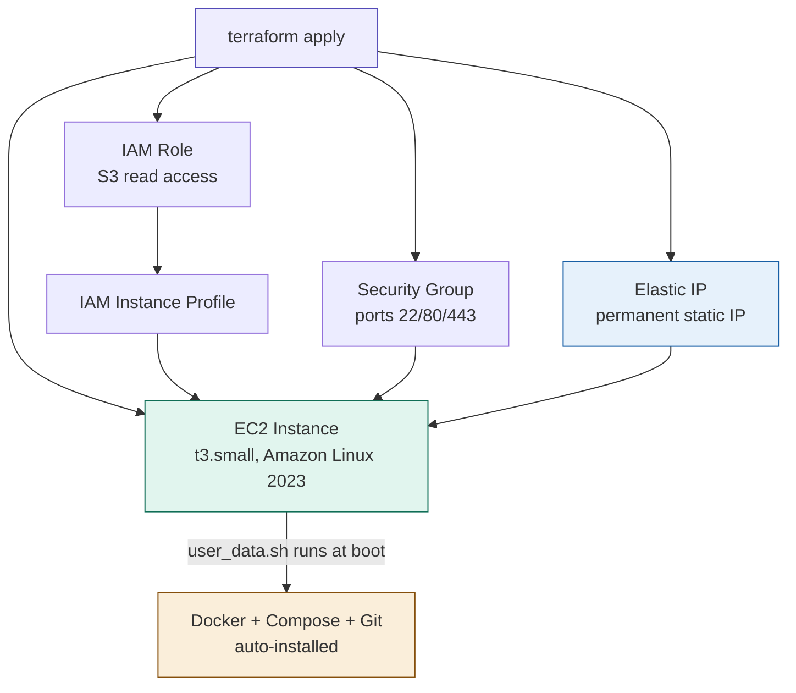

# Terraform AWS Infrastructure

Infrastructure as Code (IaC) project using Terraform to provision a complete, production-ready AWS environment automatically — replacing manual AWS Console clicks with reproducible, version-controlled code.

## What this project provisions

Running `terraform apply` automatically creates:

- **EC2 instance** (t3.small, Amazon Linux 2023, 20GB gp3 storage)
- **Elastic IP** — permanent public IP that survives instance restarts
- **Security Group** — ports 22 (SSH), 80 (HTTP), 443 (HTTPS) only
- **IAM Role + Instance Profile** — S3 read access without hardcoded credentials
- **Docker + Docker Compose + Git** — installed automatically via user_data script at first boot

## Architecture



## Usage

**Prerequisites:**
- Terraform installed
- AWS CLI configured (`aws configure`)
- Existing AWS key pair

**Deploy:**
```bash
git clone https://github.com/mhhuzaifa223/terraform-aws-pet-clinic.git
cd terraform-aws-pet-clinic
terraform init
terraform plan
terraform apply
```

**Destroy:**
```bash
terraform destroy
```

## Key concepts demonstrated

| Concept | Implementation |
|---|---|
| **Desired state** | Declare what you want, Terraform figures out how |
| **Dependency graph** | Terraform automatically creates resources in correct order |
| **Variables** | Reusable, configurable inputs — deploy different environments with different values |
| **Outputs** | Displays connection info (IP, SSH command) after apply |
| **user_data** | Server bootstraps itself — zero manual SSH setup required |
| **State management** | Terraform tracks what it created (`.tfstate` kept out of Git) |

## Why IaC matters

| Manual AWS Console | Terraform |
|---|---|
| Click through UI, easy to miss steps | Declare once, reproducible every time |
| No record of what was built | Full Git history of every infrastructure change |
| Hard to recreate exact setup | `terraform apply` → identical environment |
| Easy to make mistakes | `terraform plan` previews changes before applying |

## Tech stack

- **IaC:** Terraform
- **Cloud:** AWS (EC2, Elastic IP, Security Groups, IAM)
- **OS:** Amazon Linux 2023
- **Runtime:** Docker, Docker Compose, Git (auto-installed)